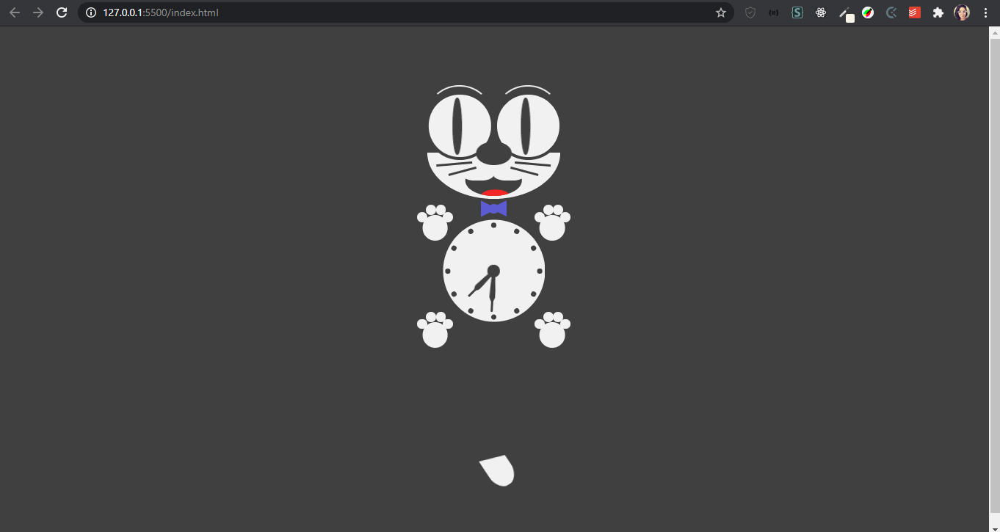

<h1 align="center">Gato Felix - HTML, CSS & JS</h1>

 

<blockquote align="center">“A chave para transformação é a continuidade. Continue a codar!!!”</blockquote>

 

 
 

## Sumário

- [Apresentação da Aplicação](#-apresentação-da-aplicação)
- [Sobre a Aplicação](#-sobre-a-aplicação)
- [Tecnologias utilizadas](#-tecnologias-utilizadas)

 

## Apresentação da Aplicação

 

  

 

## Sobre a Aplicação

 

    Esse gato Felix foi feito inteiramente em HTML, CSS e Javascript.
    Você pode encontrar o projeto <a href="https://codepen.io/jh3y/pen/LYpNyvm" target="_blank">aqui. </a> Ele foi feito pelo talentoso <a href="https://jhey.dev/" target="_blank">Jhey Tompkins</a>. Tenho treinado reproduzindo os projetos de outros devs para em breve fazer o meu por conta.

 

## Tecnologias Utilizadas

 

<code></code>
<code></code>
<code></code>

 

 
 

<h3 align="center">
    
</h3>

